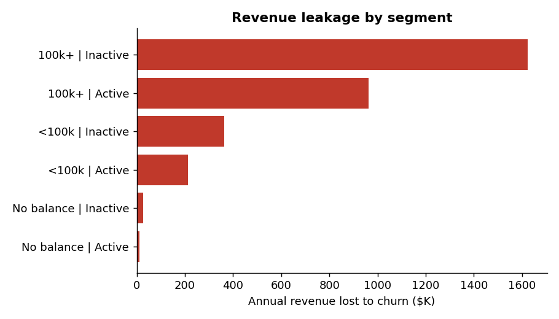

# Customer Churn & Revenue Leakage Analysis

**Question:** Which customers leave, how much revenue do we lose, and is a retention campaign worth paying for?

**Tools:** SQL (SQLite) | Python (pandas, scikit-learn, matplotlib) | Excel | Power BI



## Key findings (10,000 bank customers)
- **18.3%** of customers churned, costing about **$3.2M (20.5%)** of annual revenue.
- Inactive customers with balances over 100K are **22% of customers but about 51% of revenue lost**.
- Churn by products held is U-shaped: **25% (1 product), 7% (2), 71% (3)**.
- Random forest **AUC 0.80** vs logistic regression **0.70** (5-fold cross-validation). The top 20% by risk contain **52%** of churners.
- Targeting the **top 30%** by risk reaches 66% of churners with a net benefit of about **$542K (ROI 3.6x)**. Beyond 30%, each extra dollar returns less than $1.

**Recommendation:** Offer retention incentives to the top 30% by churn risk, prioritising inactive high-balance customers, and cross-sell a second product to single-product customers.

## Repository structure
```
customer-churn-revenue-analysis/
├── README.md
├── requirements.txt
├── customer_churn_revenue_analysis.ipynb   # full analysis (run top to bottom)
├── sql/queries.sql                         # 11 SQL queries (CTEs, window functions)
├── excel/Retention_ROI_Calculator.xlsx     # ROI calculator with sensitivity table
├── charts/                                 # key charts
└── powerbi/POWERBI_GUIDE.md                # dashboard build steps + DAX measures
```

## Method
1. **Quantify the loss:** revenue = 2% of balance + $50 per product (assumption).
2. **Explore (SQL):** RANK, NTILE, ROW_NUMBER, cumulative Pareto analysis.
3. **Segment:** rule-based segments, cross-checked with K-Means.
4. **Model:** logistic regression vs random forest, 5-fold cross-validation.
5. **ROI:** target the top X% by risk and compare benefit with offer cost.

## How to run
1. `pip install -r requirements.txt`
2. Open `customer_churn_revenue_analysis.ipynb` in Jupyter or Google Colab and click **Run all**.

## Assumptions and limitations
- Data is **synthetic**, using the Kaggle Churn_Modelling column layout, so the work is reproducible.
- The $50 offer cost, 30% save rate and revenue formula are assumptions.
- Only one year of revenue is counted; the true save rate needs an A/B test.
